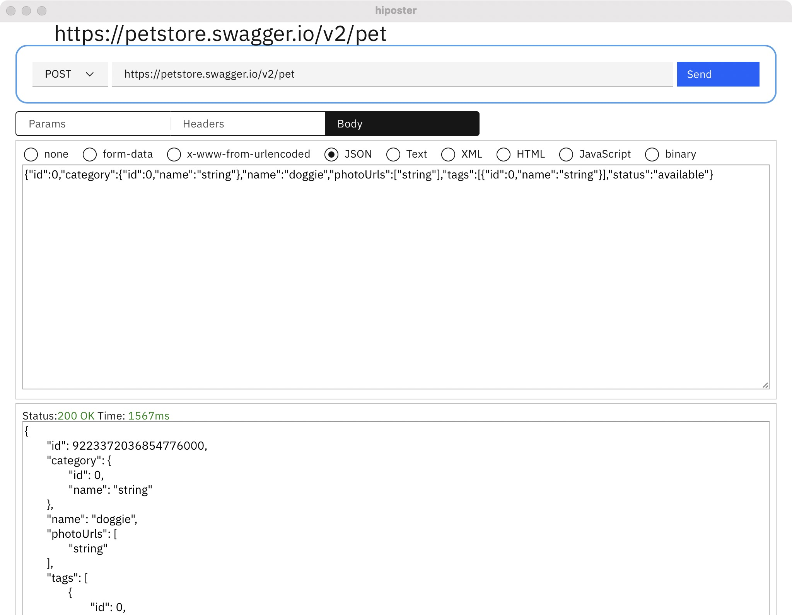

# README

## About

HiPoster is a simple and efficient http API testing client tool. Based on Wails, Go and sveltejs.


# HiPoster
[](https://github.com/obity/hiposter/releases/latest)
[](#)
[](https://github.com/obity/hiposter/releases/latest)
[](./LICENSE)


## Live Development

To run in live development mode, run `wails dev` in the project directory. This will run a Vite development
server that will provide very fast hot reload of your frontend changes. If you want to develop in a browser
and have access to your Go methods, there is also a dev server that runs on http://localhost:34115. Connect
to this in your browser, and you can call your Go code from devtools.

## Building

To build a redistributable, production mode package, use `wails build`.

```shell
# Building target: darwin/arm64

  • Generating bindings: Done.
  • Installing frontend dependencies: Done.
  • Compiling frontend: Done.
  • Compiling application: Done.
  • Packaging application: Done.
Built '/Users/lsmiao/workspace/src/github.com/obity/hiposter/build/bin/hiposter.app/Contents/MacOS/hiposter' in 6.339s.
```

# FAQ

1. macOS系统限制，提示”提示文件已损坏”，处理方法。

sudo xattr -d com.apple.quarantine /Applications/xxxx.app，注意：/Applications/xxxx.app 换成你的App路径。指定放行，删除com.apple.quarantine元数据文件，使您可以执行可执行文件。
# screen

